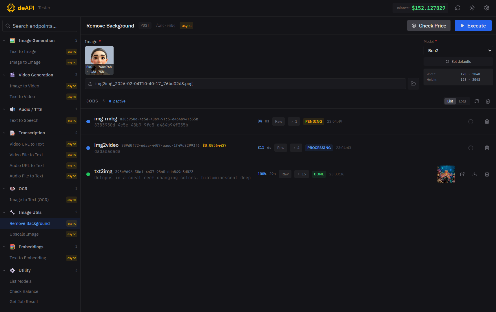

# deAPI Tester

[](https://opensource.org/licenses/MIT)
[](https://nodejs.org/)
[](https://nextjs.org/)
[](https://www.docker.com/)

A local developer tool for testing [deAPI.ai](https://deapi.ai) endpoints — unified AI inference API for image generation, video creation, audio synthesis, and more.

> **What is deAPI?** A single API to access multiple AI models (Stable Diffusion, Flux, Kling, Minimax, etc.) for image generation, video creation, text-to-speech, transcription and more. Learn more at [deapi.ai](https://deapi.ai).

## Screenshot



## Features

- **Endpoint Browser** - Browse and select from all available deAPI endpoints organized by category
- **Dynamic Forms** - Automatically generated forms based on endpoint parameters with model-aware limits and defaults
- **Dynamic Models** - Model options, limits, defaults, voices, and languages auto-discovered from API (zero code changes to add models)
- **Real-Time Job Tracking** - Live status, progress, and previews over WebSocket (Pusher/soketi) for async operations, with polling as an automatic fallback
- **Request Inspector** - View raw request/response JSON for debugging
- **Job History** - Persistent history of all requests with status, cost, and results
- **Result Preview** - Inline previews for images, videos, and audio
- **Download Manager** - Save generated results to local directory
- **Output Picker** - Reuse previously downloaded images as input (e.g. use txt2img result in img2img)
- **Random Prompts** - Dice button fills in creative prompts for quick testing
- **Balance Display** - Track your deAPI credit balance
- **Multi-Profile Config** - Multiple API profiles for different environments (production, staging, etc.)
- **Light/Dark Theme** - Toggle between light and dark mode with system preference support
- **Price Calculator** - Pre-calculate costs before sending requests

## Tech Stack

- **Framework:** Next.js 15 (App Router)
- **Language:** TypeScript (strict mode)
- **Styling:** Tailwind CSS
- **Storage:** Local JSON files (no database required)

## Getting Started

### Prerequisites

- Node.js 18+
- npm
- deAPI account and API token from [deapi.ai](https://deapi.ai)

### Installation

```bash
# Clone the repository
git clone https://github.com/deapi-ai/deapi-tester.git
cd deapi-tester
```

### Docker (recommended)

```bash
docker compose up -d
```

Open [http://localhost:1337](http://localhost:1337) — enter your API token in the settings drawer that opens automatically.

### Manual

```bash
npm install

# Start development server
npm run dev
```

Open [http://localhost:3000](http://localhost:3000) in your browser.

### Configuration

A ready-to-use **Production** profile (pointing at `https://api.deapi.ai/api/v2`) is pre-defined out of the box — you only need to add your API token. `data/config.json` is **not** shipped in the repo: it is created the first time you save, so your token is never committed.

**Option 1: UI Configuration (Recommended for local use)**

1. Click the **gear icon** in the top right corner
2. Enter your deAPI token (and, optionally, a per-profile WebSocket **Client ID** — see [Real-Time Updates](#real-time-updates-websocket))
3. Create additional profiles for other environments if needed
4. Click **Save** — your configuration is written to `data/config.json` (created on first save)

**Option 2: Environment Variables**

Copy `.env.local.example` to `.env.local`:

```bash
cp .env.local.example .env.local
```

Edit `.env.local`:

```env
DEAPI_API_TOKEN=your_token_here
DEAPI_API_URL=https://api.deapi.ai/api/v2
DEAPI_OUTPUT_DIR=./output
DEAPI_POLLING_INTERVAL_MS=2000
DEAPI_MAX_POLLING_ATTEMPTS=120
# Fallback poll interval (ms) used while the WebSocket is the primary source
DEAPI_FALLBACK_POLLING_INTERVAL_MS=10000
# Optional — only for OG/Twitter metadata (defaults to http://localhost:3000)
# NEXT_PUBLIC_SITE_URL=https://your-domain.com
```

> **Note:** WebSocket settings (Client ID, key, host) are **per profile** and are configured in the UI, not via environment variables.

**Priority:** Environment variables override `data/config.json` values when both exist.

**Git-ignored files:**
- `.env.local` - excluded from git (safe to store tokens)
- `data/config.json` - excluded from git (local configuration, created on first save)
- `data/history.json` - excluded from git (your job history)
- `output/` - excluded from git (generated files)

### Real-Time Updates (WebSocket)

Job status is delivered in real time over deAPI's WebSocket (a Pusher-compatible **soketi** server), with HTTP polling kept as an automatic fallback.

- **WebSocket = primary.** Live `processing` → `done` status, progress, and image previews stream over the socket. The connection indicator sits in the header, left of the balance: **WS live / connecting / down / off**.
- **Polling = fallback.** A slow reconciliation poll runs only when the socket is quiet (configurable via the **Fallback poll interval** setting, default 10s). It is also what surfaces **failures**, which deAPI delivers via webhooks rather than over the socket.
- **What you need to enable it:** the per-profile **API token** plus a **Client ID** (your private channel `private-client.{id}`), taken from the [deAPI dashboard](https://app.deapi.ai). Add the Client ID in **Settings → edit profile → WebSocket**. Without a Client ID, the profile simply runs on polling — nothing breaks.
- **Per-environment connection** (key, host, port) **auto-fills** from the profile's API URL (production / dev / sandbox presets), so in most cases the Client ID is the only field you add. All of these are editable in the profile's WebSocket section.

> WebSocket settings are non-secret and stored per profile in `data/config.json`; the private-channel auth is proxied through the backend (`/api/ws-auth`) so the API token never leaves the server.

## Usage

1. **Select an endpoint** from the left sidebar (grouped by category: Image, Video, Audio, etc.)
2. **Fill in the form** with required parameters (prompt, model, dimensions, etc.)
3. **Click Execute** to send the request
4. **Track progress** in the Jobs panel below:
   - View polling status for async operations
   - Click "Raw" to see the full request/response JSON
   - Preview results inline
   - Download completed results

## Project Structure

```
deapi-tester/
├── src/
│   ├── app/
│   │   ├── page.tsx              # Main UI layout
│   │   ├── layout.tsx            # Root layout (theme script)
│   │   ├── globals.css           # Global styles, CSS variables, theme definitions
│   │   ├── api/
│   │   │   ├── proxy/            # Proxy requests to deAPI
│   │   │   ├── ws-auth/          # WebSocket private-channel auth proxy
│   │   │   ├── jobs/[id]/        # One-shot job status fetch + persist (poll fallback)
│   │   │   ├── endpoints/        # GET endpoint registry
│   │   │   ├── history/          # Job history CRUD
│   │   │   ├── config/           # Configuration management
│   │   │   ├── models/           # Proxy to deAPI /models
│   │   │   ├── balance/          # Proxy to deAPI /balance
│   │   │   ├── files/            # List/serve files from output dir
│   │   │   ├── uploads/[name]/   # Serve persisted uploaded files
│   │   │   └── download/         # Download results
│   ├── components/
│   │   ├── Providers.tsx         # Root providers (Contexts + Toast)
│   │   ├── BalanceContext.tsx     # Balance state (useBalance hook)
│   │   ├── ModelsContext.tsx      # Models cache (useModelsContext hook)
│   │   ├── JobSocketContext.tsx   # WebSocket (Pusher/soketi) realtime job updates
│   │   ├── ThemeContext.tsx       # Theme state (useTheme hook)
│   │   ├── Toast.tsx             # Toast notifications (useToast hook)
│   │   ├── WsIndicator.tsx       # Header WebSocket status indicator
│   │   ├── ConfigDrawer.tsx      # Full settings drawer (profiles + WebSocket)
│   │   ├── EndpointSelector.tsx  # Endpoint browser
│   │   ├── EndpointForm.tsx      # Dynamic form generator
│   │   ├── RequestInspector.tsx  # Raw JSON viewer
│   │   ├── JobsPanel.tsx         # Job tracking & history
│   │   ├── ResultViewer.tsx      # Preview img/video/audio
│   │   ├── HistoryPanel.tsx      # Previous jobs list
│   │   ├── ModelInfo.tsx         # Model metadata display
│   │   ├── PriceCalculator.tsx   # Cost pre-calculator
│   │   ├── form/                 # Form field components
│   │   │   ├── FormField.tsx     # Generic form field renderer
│   │   │   ├── FileUploadField.tsx # File upload with preview
│   │   │   └── OutputPicker.tsx  # Pick images from output directory
│   │   └── jobs/                 # Job-related components
│   │       ├── JobRow.tsx        # Single job row
│   │       └── JobLogsView.tsx   # Logs view
│   ├── hooks/
│   │   ├── useDeApi.ts           # Main API hook
│   │   └── useConfig.ts          # Configuration hook
│   └── lib/
│       ├── endpoint-registry.ts  # Endpoint definitions (form structure only)
│       ├── deapi-client.ts       # HTTP client for deAPI
│       ├── config.ts             # Configuration management
│       ├── storage.ts            # JSON file operations
│       ├── types.ts              # TypeScript types
│       ├── constants.ts          # Shared constants
│       ├── format-utils.ts       # Formatting utilities
│       ├── form-utils.ts         # Form utilities
│       └── sample-prompts.ts     # Random prompt data
├── data/                         # Local storage (auto-created, git-ignored)
├── output/                       # Downloaded results (git-ignored)
└── ...
```

## Adding New Endpoints

Endpoints are defined in `src/lib/endpoint-registry.ts`. To add a new endpoint:

```typescript
{
  id: 'my-new-endpoint',
  name: 'My New Endpoint',
  group: 'image-generation',
  method: 'POST',
  path: '/my-endpoint',
  description: 'Does something cool',
  contentType: 'json',
  isAsync: true,
  hasPriceCalc: true,
  priceCalcPath: '/my-endpoint/price-calculation',
  params: [
    { name: 'prompt', label: 'Prompt', type: 'textarea', required: true },
    { name: 'model', label: 'Model', type: 'select', required: true },
    // NO hardcoded options/limits — they come from /models API
  ]
}
```

The form is automatically generated. Model options, limits, and defaults are loaded dynamically from the API.

## Architecture

- All requests to deAPI go through the backend proxy (`/api/proxy`) which adds the Authorization header and logs to history
- Real-time job status arrives over a WebSocket (Pusher/soketi) via `JobSocketContext`; private-channel auth is proxied through `/api/ws-auth` so the token stays server-side. A slow reconciliation poll (`/api/jobs/[id]`, every `fallbackPollIntervalMs`) is the fallback and surfaces failures (delivered by webhook, not over the socket)
- Endpoint registry defines form **structure** only (field names, types, required flags)
- All model data (slugs, limits, defaults, voices, languages) comes dynamically from `/api/models`
- Adding a new model to deAPI requires **zero code changes** — it auto-appears in the UI
- Configuration and history are stored in local JSON files

## Contributing

Contributions are welcome! Please read the [Contributing Guide](.github/CONTRIBUTING.md) before submitting a PR.

1. Fork the repository
2. Create your branch: `git checkout -b feature/my-feature`
3. Commit your changes
4. Push and open a Pull Request

## License

[MIT](LICENSE)

## deAPI Ecosystem

- [deAPI.ai](https://deapi.ai) — Unified AI inference API
- [API Documentation](https://docs.deapi.ai) — Full endpoint reference, auth, webhooks, WebSockets
- [Claude Code Skills](https://github.com/deapi-ai/claude-code-skills) — Use deAPI directly from Claude Code terminal (generate images, videos, audio, transcribe and more)
- [Report a Bug](https://github.com/deapi-ai/deapi-tester/issues)
